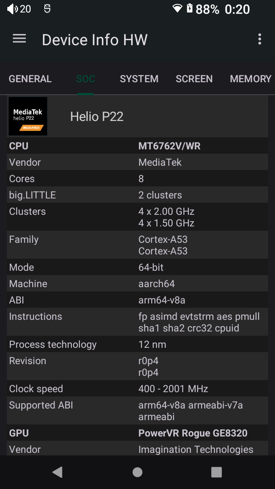

# oilsky-g88-research

Firmware research, rooting notes, low-level backup utilities, debloat tooling and custom ROM work for the Oilsky G88 DAP and close MTK-based variants.

## Project abstract

This repository documents practical methods for unlocking, backing up, rooting,
debloating and eventually building a custom ROM for the Oilsky G88 Android DAP
and closely related Chinese MTK-based digital audio players.

The Oilsky G88 is a reasonably well-built DAP, but it ships with a weak generic
Android software stack. The goal is to turn the current research into a safe,
repeatable workflow for preserving stock firmware, applying root, removing
unneeded applications and telemetry, and preparing a cleaner custom ROM.

<p align="center">
  
</p>

## Disclaimer

This repository is research material, not a guaranteed repair or flashing guide.
Use it at your own risk. I am not responsible for damaged, bricked, wiped or
otherwise unusable devices.

Do not flash anything blindly. Before any write, erase, format, bootloader,
partition, AVB or ROM experiment, make sure you have a complete and verified
backup for your exact device. Treat all write operations as potentially
destructive until proven otherwise.

## Related devices

The devices below may share enough platform or firmware behavior to benefit from
this work, but this is not verified. If you have one of these devices, do not
flash G88 files blindly. Similar branding or hardware does not mean compatible
preloader, boot images, partition layout, display panel, DRAM setup or firmware.
A wrong flash can brick the device.

- AUDIOCULAR Nexus
- Surfans F20 Pro
- Famue BF32 / BF32 HiFi
- ZAQE P30
- Blueshark R04
- Other close Oilsky/MTK DAP variants

## Device facts

- Device: Oilsky G88 DAP.
- Platform reported by mtkclient: `MT6765/MT8768t (Helio P35/G35)`, HW code `0x766`.
- Build observed on the device: `R04_62_HIFI_4_32_4.02inch_NV3051F_H411_20251204`.
- Active slot observed from Android: `_a`.
- Bootloader state: locked by default. It can be unlocked by enabling OEM
  unlocking in Android Developer options and then unlocking through fastboot.
  The currently tested unit is unlocked and shows AVB orange state.
- mtkclient reports the target as unprotected: `SBC=False`, `SLA=False`, `DAA=False`, memory read auth disabled.
- eMMC reported by DA: `RX14MB`, CID `150100525831344d420784a59062c3bd`, USER size `0x747c00000`, BOOT1/BOOT2 size `0x400000` each.

Observed Android hardware information:

<p align="center">
  
</p>

## Current layout

- `mtkclient/` - local copy of mtkclient used by the repo scripts.
- `preloader/` - known preloaders and the dumped G88 preloader.
- `stock_dump/` - versioned baseline partition readback.
- `dump/` - ignored local working readback output.
- `exploits/` - used exploits.
- `debloat/` - local ADB debloat scripts and package lists; generated `debloat/out/` output is ignored.
- `img/` - images used by this README.
- `modules/` - Magisk modules tested or staged for this device.
- `mtk_backup_critical.bat` - read-only critical partition backup script.
- `mtk_backup_system.bat` - read-only full partition backup script without `userdata`.
- `mtk_backup_userdata.bat` - read-only userdata and data-recovery state backup script.
- `gptinfo.txt` - captured GPT/reference partition map.

For an easier mtkclient setup on Windows, see
[codefl0w/mtkclient-windows-installer](https://github.com/codefl0w/mtkclient-windows-installer).

Several ADB scripts default to serial `0123456789ABCDEF`, which is the serial
observed on this device. If your unit reports a different serial, pass it as the
first script argument or edit the script variable before running it.

## Known-good preloader

`preloader/g88_preloader_exploited_from_brom.bin`

- Size: `253812`
- SHA256: `BFB7E109ABA9180A659853D76520B4B235C2C2B060661729064D61F68EFE638D`

This preloader is required for reliable DA/DRAM setup with mtkclient on this device.

It was acquired from the device through an exploit-based readback path and is
kept here as a known-good reference for this hardware revision.

Standard mtkclient/BROM access does not reliably communicate with the eMMC on
this device without a suitable preloader. Typical failures include EMI errors
and DRAM initialization failures. Use the known-good exploited G88 preloader
above for normal readback work. If needed, the other files in `preloader/` can
be tried as compatibility candidates for close hardware variants, but do not
flash any preloader blindly.

## Hardware modes

Recovery mode:

1. Power the device off.
2. Hold `NEXT` and `POWER`.
3. Release the buttons after the recovery screen appears.

BROM/preloader mode for mtkclient scripts:

1. Connect USB to the computer.
2. Start the appropriate script from this repository and wait for mtkclient to
   wait for the port.
3. Press and hold all four hardware buttons. This can be done from any current
   device state.
4. Keep holding the buttons until the connection appears in the console, then
   release them.

After an mtkclient operation, reset the device with the pinhole reset button.
The device may not leave the low-level connection state cleanly without that
hardware reset.

## Debloater

The `debloat/` directory contains ADB-based package removal scripts for the
stock Oilsky G88 firmware. The debloater uses Android user-state removal:

```bat
pm uninstall --user 0 <package>
```

This does not modify `super`, `system`, `vendor`, or other firmware partitions.
It only disables/removes packages for Android user 0, so factory reset or
`cmd package install-existing --user 0 <package>` can restore packages that are
still present in the system image.

Recommended use:

```bat
debloat\apply_creator_debloat.bat
```

The current `debloat/packages.txt` list was selected for this device to remove
unneeded packages without triggering the bootloops observed during more
aggressive experiments.

The debloater also stages an additional launcher before removing packages, so
the device should not end up without any home screen. The bundled fallback is
the open-source KISS Launcher, but you can replace the APK in `debloat/` with a
different launcher if you prefer another UI.

If you want to experiment with a different package set, use the creator first
and review its output before copying it over `debloat/packages.txt`.

Main files:

- `debloat/packages.txt` - current generated/tested package list consumed by the applier.
- `debloat/apply_creator_debloat.bat` - applies `debloat/packages.txt`.
- `debloat/creator/debloat_g88.bat` - generates default or aggressive removal plans.
- `debloat/creator/packages-default.txt` - conservative source list.
- `debloat/creator/packages-aggressive.txt` - stronger source list.
- `debloat/creator/packages-keep.txt` - central allowlist of packages that must not be removed.
- `debloat/creator/packages-optional-google-market.txt` - optional Play Store removal list.

Generate a custom plan without removing anything:

```bat
debloat\creator\debloat_g88.bat plan
```

Generate the aggressive plan:

```bat
debloat\creator\debloat_g88.bat aggressive-plan
```

The creator writes to `debloat/creator/out/packages.txt`; copy that file to
`debloat/packages.txt` only after review. Runtime snapshots and generated output
under `debloat/out/` are ignored by git.

## Critical backup

Run from the repository root:

```bat
mtk_backup_critical.bat
```

Verify existing files only:

```bat
mtk_backup_critical.bat verify
```

The script uses mtkclient `rl` and skips only the large or non-critical partitions:

```text
super, userdata, otp, flashinfo
```

It does not flash, erase, format, unlock, or write anything to the device.

Known-good `boot_a.bin` check from `stock_dump/`:

- Size: `33554432`
- SHA256: `396FFD9DA02B9B7851D7E79850AFFAD34F011186E151A903C41DEF899BDE7325`
- Android boot magic: `ANDROID!`
- Header version: `2`
- Page size: `2048`

## System backup

Run from the repository root:

```bat
mtk_backup_system.bat
```

Verify existing dump only:

```bat
mtk_backup_system.bat verify
```

The script reads all GPT partitions into `dump/`, except `userdata`.

- `super.bin` expected size: `4976541696`
- `otp.bin` and `flashinfo.bin` are included.
- `userdata` is intentionally not read.
- The script does not flash, erase, format, unlock, or write anything to the device.

## Userdata/state backup

Run from the repository root:

```bat
mtk_backup_userdata.bat
```

Verify existing dump only:

```bat
mtk_backup_userdata.bat verify
```

The script reads `userdata` plus partitions that may be needed to keep encrypted
Android 12/FBE data restorable on the same physical device:

```text
userdata, metadata, nvdata, nvcfg, nvram, protect1, protect2, proinfo, sec1, seccfg, frp
```

- Output directory: `dump/userdata/`.
- `userdata.bin` expected size: `25393332224`.
- This is intended as a same-device recovery backup, not a portable Android data migration.
- The script does not flash, erase, format, unlock, or write anything to the device.

## Magisk root

Make a verified backup before flashing any patched image. Rooting requires an
unlocked bootloader and will keep the device in AVB orange state.

Stage Magisk and the active stock boot image from Android:

```bat
root\push_magisk_and_active_boot.bat
```

The script:

- uses ADB serial `0123456789ABCDEF` by default;
- detects the active slot from `ro.boot.slot_suffix`;
- verifies that the matching `dump\boot_a.bin` or `dump\boot_b.bin` has Android
  boot magic and the expected size;
- pushes `root\Magisk-v30.7.apk` to `/sdcard/Magisk-v30.7.apk`;
- pushes the active stock boot image to `/sdcard/boot_stock.bin`;
- does not flash, erase, patch, reboot or write any partition.

Install/open Magisk on the device and patch `/sdcard/boot_stock.bin`. Pull the
patched image back to the repo, for example:

```bat
adb -s 0123456789ABCDEF pull /sdcard/Download/magisk_patched*.img root\boot_magisk.img
```

Reboot to fastboot and flash only the currently active boot slot. For the tested
unit the active slot was `_a`:

```bat
adb -s 0123456789ABCDEF reboot bootloader
fastboot flash boot_a root\boot_magisk.img
fastboot reboot
```

If your active slot is `_b`, flash `boot_b` instead. Do not blindly flash both
slots unless you have a verified recovery path and intentionally want both slots
modified.

## Magisk modules

The `modules/` directory contains a Hi-Res Audio Enabler Magisk module:

```text
modules/Hi-Res-Audio-Enabler-MagiskModule.zip
```

Install it after Magisk root is working:

1. Copy or keep the module ZIP on the device.
2. Open Magisk.
3. Go to `Modules`.
4. Choose `Install from storage`.
5. Select `Hi-Res-Audio-Enabler-MagiskModule.zip`.
6. Reboot after installation.

The module enables Android high-resolution audio output properties that are
normally disabled or hidden on many generic Android builds. On this DAP it is
intended to expose/use Hi-Res audio paths more reliably for compatible players
and audio backends.

## Credits

- MTK readback and low-level tooling:
  [bkerler/mtkclient](https://github.com/bkerler/mtkclient).
- Magisk root tooling:
  [topjohnwu/Magisk](https://github.com/topjohnwu/Magisk).
- Hi-Res Audio Enabler Magisk Module by
  [reiryuki](https://github.com/reiryuki/Hi-Res-Audio-Enabler-Magisk-Module).
- Some repository ideas and module packaging references were inspired by
  [ftomitar/oilsky-m308 Hi-Res-Audio-Enabler-MagiskModule.zip](https://github.com/ftomitar/oilsky-m308/blob/main/magisk_modules/Hi-Res-Audio-Enabler-MagiskModule.zip).
